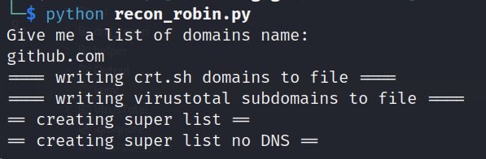

# About
Recon robin is a recon tool used to automate the recon proccess. 

Given a domain, Recon Robin will
1. Grab all unique subdomains from crt.sh
2. Grab all unique subdomains from virustotal 
3. Grab all unique domains that it can find in any DNS record

# Usage
To use this, you need to do the following:
1. Be on linux or another system that has the `dig` command
2. Create a file called `secrets.json` with your virustotal API key (can be community version)
3. Install the `requests` module in python `pip install requests`

## Virustotal API key
The `secrets.json` should be formated like this:
```
{
  "virus_total_api_key": "your_api_key"
}
```

# How-to example
## Run all scans
1. Run recon robin: `python recon_robin.py`
2. Write all the domains you want to recon in a comma seperated list, for example: `github.com, gitlab.com, bitbucket.com`
3. Click enter, sit back and watch recon robin grab the domains


## Run only DNS recon
1. Run recon robin: `python recon_robin.py --dns-only`
2. You can optionally add a `--ip <ip address>` to spesicy what dns server you want to query
2. Write all the domains you want to recon in a comma seperated list, for example: `github.com, gitlab.com, bitbucket.com`
3. Click enter, sit back and watch recon robin grab the domains
